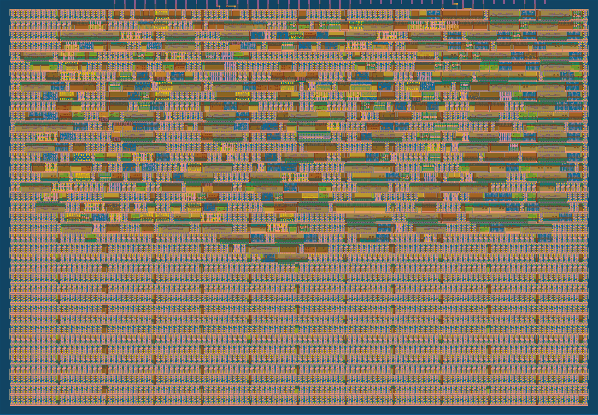

# Optimization Reports
This file serves to keep track of how well each iteration of a design performs.
This can be in terms of number of tests passed, gates used, area used etc.

## main_controller

For the main report, look at main_controller_iterations.csv.
below are some images from different hardened designs.

### V1
